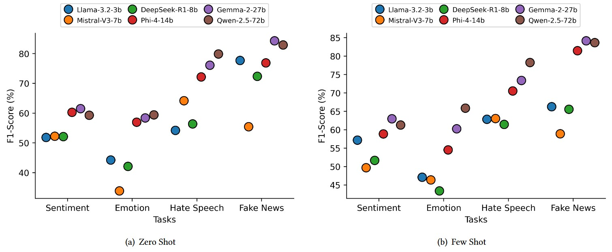

# Evaluating the Effectiveness of Open-Source LLMs for Multi-Domain Bengali Text Classification with Zero-Shot and Few-Shot Prompting


### ABSTRACT

Large Language Models (LLMs) have shown remarkable ability to process multilingual texts, while Bengali is still an underrepresented language. This is due to the unavailability of large linguistic resources and the lack of a standard benchmarking framework, which has yet to be established. In this study, six open-source LLMs, which include LLaMA-3.2-3B, Mistral-V3-7B, DeepSeek-R1-8B, Phi-4-14B, Gemma-2-27B, and Qwen-2.5-72B, are evaluated using four critical text classification tasks in Bengali, such as sentiment analysis, emotion recognition, hate-speech detection, and fake-news classification. We compared two prompting methods in the context of zero-shot and few-shot prompting using the vLLM model to investigate the adaptability of the model in resource-limited settings. The measurements of performance were based on Accuracy (Acc.), Precision (P), Recall (R), and F1-score (F1) measures. The results of our study indicate that, regardless of the dataset, the bigger multilingual models always performed better in comparison with the smaller ones. When training in zero-shot, Qwen-2.5-72B showed the best performance at 79.9% accuracy and 79.88% F1-score, showing specific effectiveness on hate-speech detection. In the case of fake news, Gemma-2-27B performed best at 84.45% accuracy and 84.33% F1- score. With a few-shot set-up, Gemma-2-27B and Qwen-2.5-72B had a high level of performance in terms of F1-score, 84.17 and 65.86, respectively. It is worth noting that few-shot prompting increased Recall by an average of about 6%, which proves the usefulness of in-context learning in low-resource settings. This study highlights the possibilities of large multilingual models in enabling robust, scalable, and accessible Bengali natural language processing applications.


<p align="center">
    <a></a>  <br>
</p>
<p>
<em> LLMs performance with two prompt settings across various classification tasks including Sentiment Analysis, Emotion Recognition, Hate Speech Detection, and Fake News Detection.</em></p>


# Instructions

- To run the script you need to  install `Python=3.10.x`. For LLM inference, both [vLLM](https://docs.vllm.ai/en/stable/index.html) and Huggingface `Pipeline` has been used. 

- If you are using any IDE, then first clone (`git clone <url>`) the repository. Then create a virtual environment and activate it.

  ```
  conda create -n NLU Python=3.10.12 
  conda activate NLU
  ```    

- Install all the dependencies.<br>
  ```
  pip install -r requirements.txt
  ```
## Evaluated LLMs

We downloaded the instruct version of the models from the Huggingface Library.

- [Llama-3.2-3B](https://huggingface.co/meta-llama/Llama-3.2-3B-Instruct)
- [Mistral-V3-7B](https://huggingface.co/mistralai/Mistral-7B-Instruct-v0.3)
- [DeepSeek-R1-8B](https://huggingface.co/deepseek-ai/DeepSeek-R1-Distill-Llama-8B) (Llama Distilled)
- [Phi-4-14B](https://huggingface.co/microsoft/phi-4)
- [Gemma-2-27B](https://huggingface.co/google/gemma-2-27b)
- [Qwen-2.5-72B-AWQ](https://huggingface.co/Qwen/Qwen2.5-72B-Instruct-AWQ)

Prompts for each task are organized in the `Prompts` folder.


## LLM inference (Examples)

To get the **Llama** model response with **Zero-Shot** prompting for any task, run the following script. If you are not in the `Scripts` folder.

```
cd Scripts

python zero_few_shot.py \
--llm_id meta-llama/Llama-3.2-3B-Instruct \
--llm_name llama32-3B \
--dataset_name emo \            # emotion recognition
--prompt_type zero              # zero shot prompting
```

To get the **Qwen** model response with **Few-Shot** prompting for any task, run the following script. If you are not in the `Scripts` folder.

```
cd Scripts

python zero_few_shot.py \
--llm_id Qwen/Qwen2.5-72B-Instruct-AWQ \
--llm_name qwen-72B \
--dataset_name hate \        # hate speech detection
--prompt_type few           # few shot prompting
```


**Arguments**

- `--llm_id`: Specify the LLM want to use.
- `--llm_name`: Specify the llm name.
- `--dataset_name`: Specify dataset name (<u>option:</u> `senti`,`emo`,`hate`, or `fake`).
- `--prompt_type`: Specify the **prompting** technique you want to use. (`zero`,`few`)

You will get an excel file in **Results/** folder that store the responses for the corresponding LLM.

*The `plot-notebook.ipynb`* file contains the code for the result visualization.

---


"# Evaluating-Open-Source-LLMs-for-Bengali-Text-Classification-Across-Multiple-Domains" 
